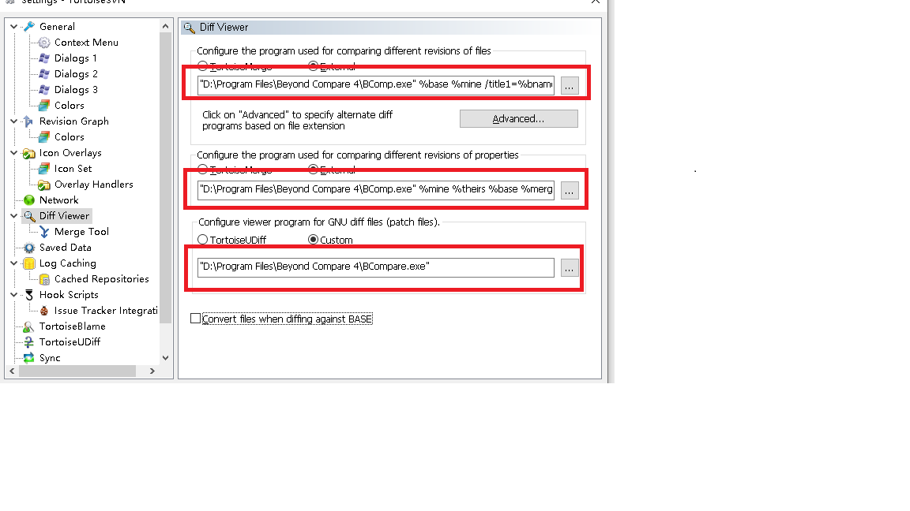
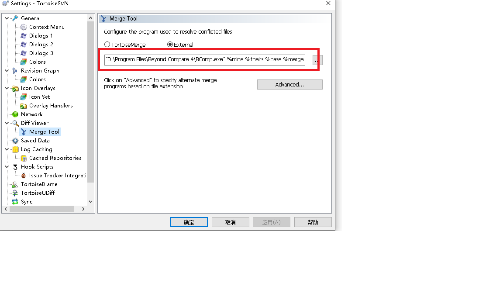

# SVN配置Beyond Compare

## DiffViewer




```shell
"D:\Program Files\Beyond Compare 4\BComp.exe" %base %mine /title1=%bname /title2=%yname /leftreadonly

"D:\Program Files\Beyond Compare 4\BComp.exe" %mine %theirs %base %merged /title1=%yname /title2=%tname /title3=%bname /title4=%mname

"D:\Program Files\Beyond Compare 4\BCompare.exe"
```


## MergeTool



```SHELL
"D:\Program Files\Beyond Compare 4\BComp.exe" %mine %theirs %base %merged /title1=%yname /title2=%tname /title3=%bname /title4=%mname
```

