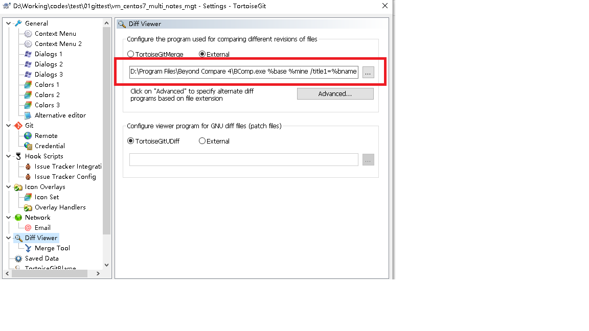
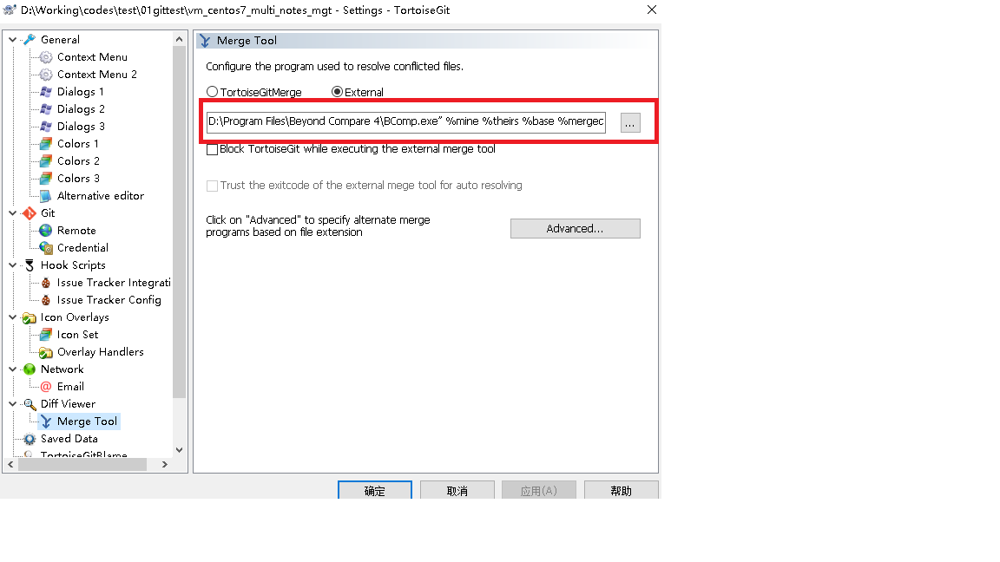

# tortoigit配置beyond compare

## Diff Viewer



```shell
D:\Program Files\Beyond Compare 4\BComp.exe %base %mine /title1=%bname /title2=%yname /leftreadonly
```


## MergeTool



```shell
D:\Program Files\Beyond Compare 4\BComp.exe” %mine %theirs %base %merged /title1=%yname /title2=%tname /title3=%bname /title4=%mname
```

